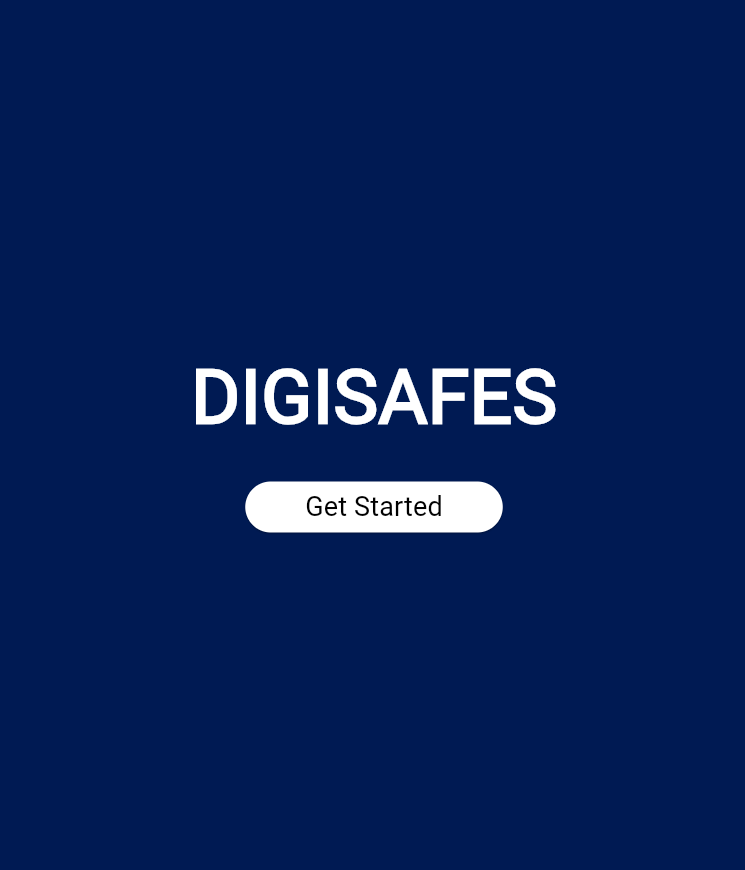
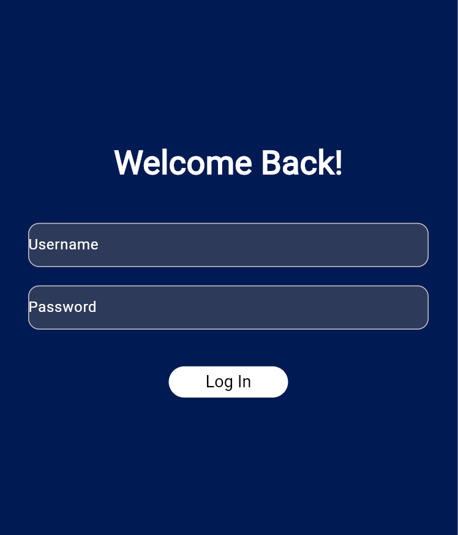
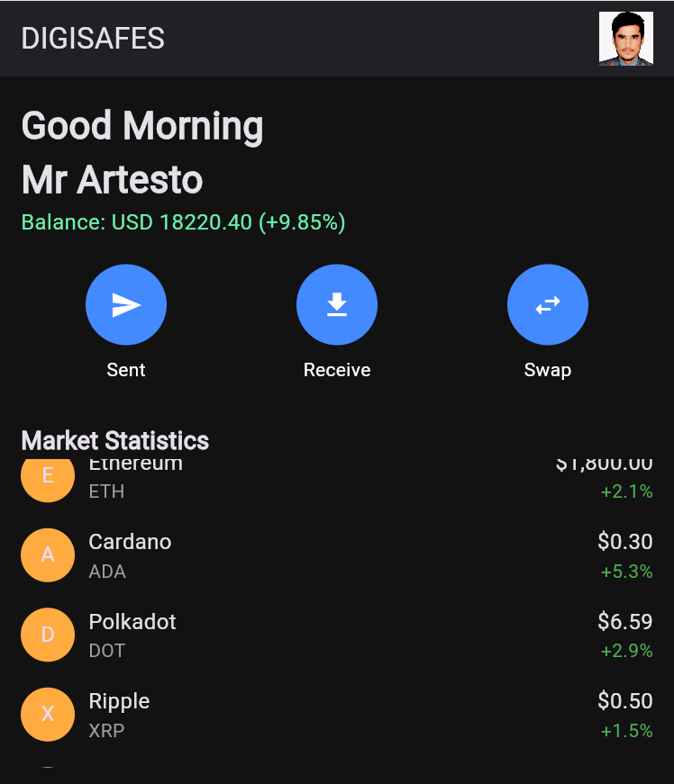
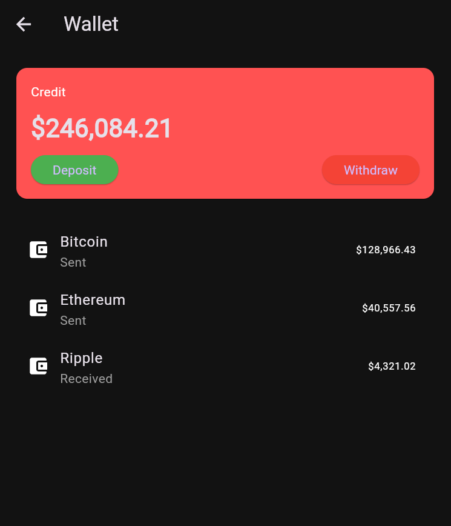

DigiSafes - Digital Wallet Application
DigiSafes is a secure and user-friendly mobile application designed to simplify cryptocurrency management. This app allows users to track their balances, view market statistics, and perform essential operations such as sending, receiving, and swapping cryptocurrencies. With a modern and intuitive interface, DigiSafes ensures a seamless experience for both novice and experienced users.
Features
•	User Authentication: Secure login system to protect user data.
•	Dashboard Overview: 
o	Displays user balance and percentage changes.
o	Market statistics for popular cryptocurrencies.
•	Crypto Transactions: 
o	Send and receive digital assets.
o	Swap cryptocurrencies easily.
•	Wallet Management: 
o	View transaction history.
o	Deposit and withdraw funds.
•	Responsive Design: 
o	Optimized for a smooth experience on various devices.
Screenshots

     
Getting Started
Prerequisites
Ensure you have the following installed:
•	Flutter SDK: Installation Guide
•	Android Studio or Visual Studio Code for development.
Installation
1.	Clone the repository: 
2.	git clone https://github.com/hameednasar/digisafes_wallet?tab=readme-ov-file
3.	Navigate to the project directory: 
4.	cd digisafes
5.	Install dependencies: 
6.	flutter pub get
7.	Run the app: 
8.	flutter run
Technology Stack
•	Flutter: For cross-platform app development.
•	Dart: Programming language for the application.
File Structure
DigiSafes/
├── lib/
│   ├── main.dart           # Entry point of the application
│   ├── splash_screen.dart  # Splash screen widget
│   ├── login_screen.dart   # Login functionality
│   ├── dashboard_screen.dart # Main dashboard
│   ├── wallet_screen.dart  # Wallet management
│   ├── swap_screen.dart    # Swap functionality
├── assets/
│   ├── images/             # App images and icons
├── pubspec.yaml            # Dependencies and assets configuration
How to Use
1.	Launch the app.
2.	Login with your credentials.
3.	Access the dashboard to: 
o	View your balance.
o	Perform transactions (send, receive, swap).
4.	Check market statistics for the latest crypto prices and trends.
5.	Manage your wallet to track transaction history.
Demo
[https://www.youtube.com/shorts/NjrSnD4Vd9w]
Future Enhancements
•	Integration with real-time APIs for live cryptocurrency prices.
•	Advanced security features such as biometric authentication.
•	Portfolio management tools for tracking investment performance.
Contribution
Contributions are welcome! If you'd like to enhance DigiSafes, follow these steps:
1.	Fork the repository.
2.	Create a new branch: 
3.	git checkout -b feature-name
4.	Commit your changes: 
5.	git commit -m "Add feature-name"
6.	Push to the branch: 
7.	git push origin feature-name
8.	Create a pull request.
License
This project has no license
For inquiries or support, contact:
•	Name: Hamid ullah
•	Email: uhameed728@gmail.com
________________________________________
DigiSafes - Simplifying Cryptocurrency Management

